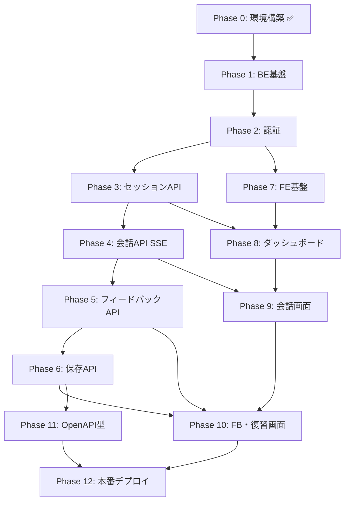

# 実装ロードマップ

> 本プロジェクトの実装順序ガイド。技術的な決定事項は [SPEC.md](./SPEC.md)、環境構築は [SETUP.md](./SETUP.md) を参照する。

---

## 目次

1. [実装の基本方針](#1-実装の基本方針)
2. [進捗サマリー](#2-進捗サマリー)
3. [フェーズ一覧](#3-フェーズ一覧)
4. [各フェーズの詳細](#4-各フェーズの詳細)
5. [依存関係図](#5-依存関係図)
6. [後回し項目](#6-後回し項目)

---

## 1. 実装の基本方針

### 1.1 バックエンド先行 → フロントエンド接続

API の契約（エンドポイント・レスポンス形式）を先に固め、フロントエンドはそれに接続する。
OpenAPI スキーマが生成できてから型を同期する。

### 1.2 縦割りで機能を完成させる

「DB → API → 画面」を1機能単位で通す。例: 認証が動いてからダッシュボード、セッション API が動いてから会話画面。

### 1.3 各フェーズに完了条件を設ける

フェーズを完了したら、**ブラウザまたは curl で動作確認**してから次へ進む。

### 1.4 1フェーズ = 1 PR 相当の粒度（推奨）

レビューしやすく、問題の切り分けも容易になる。

---

## 2. 進捗サマリー

| フェーズ | 内容 | 状態 |
|----------|------|------|
| 0 | 環境構築・骨格 | **完了** |
| 1 | バックエンド基盤（DB・設定・エラー処理） | 未着手 |
| 2 | 認証（FastAPI Users） | 未着手 |
| 3 | セッション API | 未着手 |
| 4 | 会話 API（SSE + OpenAI） | 未着手 |
| 5 | 会話後フィードバック API | 未着手 |
| 6 | 保存・復習 API | 未着手 |
| 7 | フロントエンド基盤（ルーティング・認証） | 未着手 |
| 8 | ダッシュボード・セッション作成画面 | 未着手 |
| 9 | 会話画面（Web Speech API） | 未着手 |
| 10 | フィードバック・復習画面 | 未着手 |
| 11 | OpenAPI 型生成の運用 | 未着手 |
| 12 | 本番デプロイ | 未着手 |

### フェーズ 0 で完了しているもの

- モノレポ構成、`docker-compose.yml`
- バックエンド: FastAPI 骨格、`GET /health`
- フロントエンド: Vite + React + Tailwind + shadcn/ui
- Neon / `.env` の準備（接続はこれから）

---

## 3. フェーズ一覧

```
[0 完了] 環境構築
    ↓
[1] バックエンド基盤 ─────────────────────────┐
    ↓                                          │
[2] 認証                                       │
    ↓                                          │
[3] セッション API                             │ バックエンド
    ↓                                          │
[4] 会話 API（SSE）                            │
    ↓                                          │
[5] フィードバック API                         │
    ↓                                          │
[6] 保存・復習 API ────────────────────────────┘
    ↓
[7] フロントエンド基盤（ルーティング・認証）
    ↓
[8] ダッシュボード・セッション作成
    ↓
[9] 会話画面
    ↓
[10] フィードバック・復習画面
    ↓
[11] OpenAPI 型生成の運用整備
    ↓
[12] 本番デプロイ
```

---

## 4. 各フェーズの詳細

---

### フェーズ 1: バックエンド基盤

**目的:** DB 接続・設定・共通処理を整え、以降の API 実装の土台を作る。

#### 作業内容

| # | タスク | 成果物 |
|---|--------|--------|
| 1-1 | `app/config.py` — 環境変数読み込み（`pydantic-settings`） | 設定モジュール |
| 1-2 | `app/database.py` — asyncpg プール + SQLAlchemy エンジン | DB 接続 |
| 1-3 | Alembic `env.py` 設定（非同期対応） | マイグレーション基盤 |
| 1-4 | マイグレーション: `user` テーブル（FastAPI Users 用） | `alembic/versions/..._create_user_table.py` |
| 1-5 | マイグレーション: 業務テーブル（生 SQL） | `conversation_sessions`, `messages`, `saved_items` |
| 1-6 | マイグレーション: インデックス | SPEC 6.3 参照 |
| 1-7 | 共通エラーハンドラ（SPEC 7.3 形式） | 例外 → JSON レスポンス |
| 1-8 | リクエスト ID ミドルウェア | `X-Request-ID` |
| 1-9 | 構造化ログ（JSON） | `logging` 設定 |
| 1-10 | CORS 設定 | `CORS_ORIGINS` |

#### 完了条件

- [ ] `alembic upgrade head` が Neon で成功する
- [ ] `GET /health` が引き続き動作する
- [ ] 存在しないエンドポイントが統一エラー形式で返る

#### 参照

- SPEC 6（データモデル）、12（マイグレーション）、13（ログ）、14（セキュリティ）

---

### フェーズ 2: 認証

**目的:** ユーザー登録・ログイン・JWT 認証を有効化する。

#### 作業内容

| # | タスク | 成果物 |
|---|--------|--------|
| 2-1 | SQLAlchemy `User` モデル（FastAPI Users 準拠） | `app/models/user.py` |
| 2-2 | FastAPI Users 設定（JWT 戦略） | `app/auth/` |
| 2-3 | 認証ルーター登録 | `main.py` にマウント |
| 2-4 | 認証必須の依存関数（`user_id` 取得） | `app/auth/deps.py` 等 |

#### 完了条件

- [ ] `POST /auth/register` でユーザー作成できる
- [ ] `POST /auth/jwt/login` で JWT を取得できる
- [ ] `GET /users/me` に Bearer トークンでアクセスできる
- [ ] トークンなしで業務 API にアクセスすると 401 になる

#### 参照

- SPEC 4（認証）

---

### フェーズ 3: セッション API

**目的:** 会話セッションの作成・一覧・詳細・完了を実装する。

#### 作業内容

| # | タスク | 成果物 |
|---|--------|--------|
| 3-1 | `repositories/sessions.py` — 生 SQL クエリ | CRUD 関数 |
| 3-2 | Pydantic スキーマ（リクエスト / レスポンス） | `app/schemas/sessions.py` |
| 3-3 | `POST /api/sessions` | セッション作成 |
| 3-4 | `GET /api/sessions` | 一覧（`user_id` でスコープ） |
| 3-5 | `GET /api/sessions/{id}` | 詳細 |
| 3-6 | `POST /api/sessions/{id}/complete` | 会話終了（`status=completed`） |
| 3-7 | 認可チェック（他ユーザーのセッションは 403） | 全エンドポイント |

#### 完了条件

- [ ] JWT 付きでセッションを作成・一覧・詳細取得できる
- [ ] 他ユーザーのセッション ID でアクセスすると 403 / 404 になる
- [ ] `complete` 後に `status` が `completed` になる

#### 参照

- SPEC 6.2 `conversation_sessions`、7.1 セッション API

---

### フェーズ 4: 会話 API（SSE + OpenAI）

**目的:** AI との会話（相手役）をストリーミングで実現し、メッセージを DB に保存する。

#### 作業内容

| # | タスク | 成果物 |
|---|--------|--------|
| 4-1 | `app/prompts/conversation.txt` — 会話用システムプロンプト | プロンプトテンプレート |
| 4-2 | `services/openai_service.py` — Chat Completions ストリーミング | OpenAI 連携 |
| 4-3 | `repositories/messages.py` — メッセージ保存（生 SQL） | CRUD |
| 4-4 | `POST /api/sessions/{id}/messages` — SSE 応答 | `chunk` / `done` イベント |
| 4-5 | ユーザーメッセージ・AI 応答の両方を `messages` に保存 | DB 永続化 |
| 4-6 | `active` セッションのみ会話可能なバリデーション | ビジネスルール |

#### 完了条件

- [ ] curl またはフロントなしで SSE ストリームが返る
- [ ] 会話後、`messages` テーブルに user / assistant の両方が保存される
- [ ] `completed` セッションにはメッセージ送信できない（400）

#### 参照

- SPEC 5.1〜5.2（会話フロー）、7.2（SSE 仕様）

---

### フェーズ 5: 会話後フィードバック API

**目的:** 会話終了後に AI が文法・語彙・自然さ・発音の指摘をまとめて返す。

#### 作業内容

| # | タスク | 成果物 |
|---|--------|--------|
| 5-1 | `app/prompts/feedback.txt` — フィードバック用プロンプト | プロンプトテンプレート |
| 5-2 | `services/feedback_service.py` — 会話ログを入力に JSON 生成 | `response_format: json_object` |
| 5-3 | `POST /api/sessions/{id}/feedback` | 一括 JSON 返却 |
| 5-4 | `completed` セッションのみ実行可能 | バリデーション |

#### 完了条件

- [ ] 完了済みセッションに対し、SPEC 5.4 形式の JSON が返る
- [ ] `type` が `grammar` / `vocabulary` / `naturalness` / `pronunciation` のいずれかである
- [ ] アクティブセッションでは 400 になる

#### 参照

- SPEC 5.3〜5.4（フィードバック）

---

### フェーズ 6: 保存・復習 API

**目的:** ユーザーが選択した誤り・表現を保存し、一覧で取得できるようにする。

#### 作業内容

| # | タスク | 成果物 |
|---|--------|--------|
| 6-1 | `repositories/saved_items.py` — 生 SQL | CRUD |
| 6-2 | `POST /api/saved-items` | 手動保存 |
| 6-3 | `GET /api/saved-items` | 復習一覧 |
| 6-4 | `DELETE /api/saved-items/{id}` | 削除 |
| 6-5 | 全操作で `user_id` スコープ | 認可 |

#### 完了条件

- [ ] フィードバック結果から項目を保存・一覧取得・削除できる
- [ ] 他ユーザーの保存項目にアクセスできない

#### 参照

- SPEC 5.5〜5.6、6.2 `saved_items`、7.1 保存 API

---

### フェーズ 7: フロントエンド基盤

**目的:** ルーティング・認証状態・API クライアントの共通基盤を作る。

> **タイミング:** フェーズ 2（認証 API）完了後に着手するのが効率的。

#### 作業内容

| # | タスク | 成果物 |
|---|--------|--------|
| 7-1 | React Router 設定 | `src/App.tsx` + ルート定義 |
| 7-2 | ページ骨格の作成 | `src/pages/` |
| 7-3 | レイアウトコンポーネント | ヘッダー・ナビ等 |
| 7-4 | `lib/api.ts` — axios インスタンス（Bearer 付与） | HTTP クライアント |
| 7-5 | `stores/authStore.ts` — Zustand（トークン管理） | 認証状態 |
| 7-6 | 認証ガード（未ログイン → `/login`） | Protected Route |
| 7-7 | `/` ランディングページ | 未認証向け |
| 7-8 | `/login`, `/register` ページ | 認証フォーム |
| 7-9 | ログイン成功 → `/dashboard` リダイレクト | SPEC 8.1 |

#### ルート一覧（SPEC 8.1）

| パス | ページ | フェーズ |
|------|--------|----------|
| `/` | ランディング | 7-7 |
| `/login` | ログイン | 7-8 |
| `/register` | 登録 | 7-8 |
| `/dashboard` | ダッシュボード | 8 |
| `/sessions/new` | 新規セッション | 8 |
| `/sessions/:id` | 会話 | 9 |
| `/sessions/:id/feedback` | フィードバック | 10 |
| `/review` | 復習一覧 | 10 |

#### 完了条件

- [ ] 未ログインで `/dashboard` にアクセスすると `/login` へリダイレクトされる
- [ ] 登録・ログイン後に `/dashboard` へ遷移できる
- [ ] ランディングページが表示される

#### 参照

- SPEC 8.1〜8.2

---

### フェーズ 8: ダッシュボード・セッション作成

**目的:** セッション一覧の表示と、新規会話（状況設定）の開始。

> **前提:** フェーズ 3（セッション API）完了

#### 作業内容

| # | タスク | 成果物 |
|---|--------|--------|
| 8-1 | `/dashboard` — セッション一覧表示 | `GET /api/sessions` 接続 |
| 8-2 | `/sessions/new` — 状況（シナリオ）入力フォーム | Textarea + 送信 |
| 8-3 | セッション作成後 `/sessions/:id` へ遷移 | `POST /api/sessions` |
| 8-4 | 空状態・ローディング・エラー表示 | UX 最低限 |

#### 完了条件

- [ ] ダッシュボードに過去セッション一覧が表示される
- [ ] 状況を入力して新規セッションを作成し、会話画面へ遷移できる

---

### フェーズ 9: 会話画面

**目的:** AI との英会話 UI。音声入力と SSE ストリーミング表示。

> **前提:** フェーズ 4（会話 API）完了

#### 作業内容

| # | タスク | 成果物 |
|---|--------|--------|
| 9-1 | メッセージ一覧 UI（ユーザー / AI） | チャット風レイアウト |
| 9-2 | テキスト入力 + 送信 | `POST .../messages` |
| 9-3 | SSE 受信・逐次表示 | EventSource または fetch stream |
| 9-4 | Web Speech API 統合 | 音声 → テキスト |
| 9-5 | Safari 非対応時のテキスト入力フォールバック | SPEC 8.4 |
| 9-6 | 「会話を終了」ボタン | `POST .../complete` → フィードバック画面へ |
| 9-7 | Zustand で会話メッセージ状態管理 | `stores/sessionStore.ts` |

#### 完了条件

- [ ] テキストまたは音声で発話し、AI の返答がストリーミング表示される
- [ ] 会話終了後、フィードバック画面へ遷移できる
- [ ] ページ再読み込みで過去メッセージが復元される（`GET /api/sessions/{id}`）

#### 参照

- SPEC 3.2（音声）、5.1（会話フロー）、8.4（Web Speech API）

---

### フェーズ 10: フィードバック・復習画面

**目的:** 会話後の指摘表示と、手動保存・復習一覧。

> **前提:** フェーズ 5・6（フィードバック / 保存 API）完了

#### 作業内容

| # | タスク | 成果物 |
|---|--------|--------|
| 10-1 | `/sessions/:id/feedback` — フィードバック一覧表示 | `POST .../feedback` |
| 10-2 | 指摘項目の手動選択 UI | チェックボックス等 |
| 10-3 | 選択項目の保存 | `POST /api/saved-items` |
| 10-4 | `/review` — 保存一覧（復習） | `GET /api/saved-items` |
| 10-5 | 保存項目の削除 | `DELETE /api/saved-items/{id}` |
| 10-6 | タイプ別表示（文法 / 語彙 / 自然さ / 発音） | ラベル・フィルタ |

#### 完了条件

- [ ] 会話後に指摘が一覧表示される
- [ ] 選択した項目だけ保存でき、復習ページで一覧できる
- [ ] 保存項目を削除できる

#### 参照

- SPEC 5.3〜5.6、8.1

---

### フェーズ 11: OpenAPI 型生成の運用

**目的:** フロントエンドの型安全性を API と同期させる。

> **タイミング:** バックエンド API が一通り揃った時点（フェーズ 6 完了後）で実施。

#### 作業内容

| # | タスク | 成果物 |
|---|--------|--------|
| 11-1 | `npm run generate:api` で型生成 | `api.generated.ts` |
| 11-2 | axios レスポンスに型を適用 | `lib/api.ts` 等 |
| 11-3 | API 変更時の再生成手順をドキュメント化 | SETUP または本ファイル |

#### 完了条件

- [ ] 主要 API 呼び出しが生成型を使用している
- [ ] バックエンド変更後に型再生成でビルドが通る

#### 参照

- SPEC 8.3

---

### フェーズ 12: 本番デプロイ

**目的:** Cloudflare Pages + Railway + Neon で本番環境を稼働させる。

> **前提:** フェーズ 1〜10 がローカル / Docker で動作していること

#### 作業内容

| # | タスク | 成果物 |
|---|--------|--------|
| 12-1 | Neon 本番 DB + マイグレーション適用 | `alembic upgrade head` |
| 12-2 | Railway にバックエンドデプロイ | 環境変数設定 |
| 12-3 | Cloudflare Pages にフロントデプロイ | `VITE_API_BASE_URL` |
| 12-4 | CORS 本番オリジン設定 | `CORS_ORIGINS` |
| 12-5 | SPA フォールバック設定 | `_redirects` 等 |
| 12-6 | 本番動作確認（登録 → 会話 → フィードバック → 復習） | E2E 手動テスト |

#### 完了条件

- [ ] 本番 URL で全主要フローが動作する
- [ ] HTTPS で通信されている

#### 参照

- SPEC 11（環境変数）、15（デプロイ）

---

## 5. 依存関係図



### 並行作業の目安

| バックエンド | フロントエンド | 条件 |
|-------------|---------------|------|
| フェーズ 1〜2 | — | BE のみ |
| フェーズ 3 | フェーズ 7（ルーティング・認証 UI） | 認証 API 完了後 |
| フェーズ 4〜6 | フェーズ 8 の準備（UI モック） | API 未完成でも UI 骨格は作れる |
| — | フェーズ 8〜10 | 対応する API 完了後に接続 |

---

## 6. 後回し項目

以下は MVP 完了後に検討する（SPEC 2.3 と同様）。

- 間隔反復（SRS）復習
- 課金・プラン制限
- UI 多言語対応
- 管理者画面
- 自動テスト・CI/CD
- Sentry 等の監視
- Google OAuth など追加認証

---

## 次のアクション

**今すぐ着手するフェーズ: 1（バックエンド基盤）**

1. Neon の接続文字列を `.env` に設定
2. `app/config.py` / `app/database.py` を作成
3. Alembic マイグレーションを作成・適用

---

## 関連ドキュメント

| ファイル | 内容 |
|----------|------|
| [SPEC.md](./SPEC.md) | 技術仕様・API・DB 設計 |
| [SETUP.md](./SETUP.md) | 開発環境の構築手順 |

---

## 変更履歴

| 日付 | 内容 |
|------|------|
| 2025-06-21 | 初版作成 |
